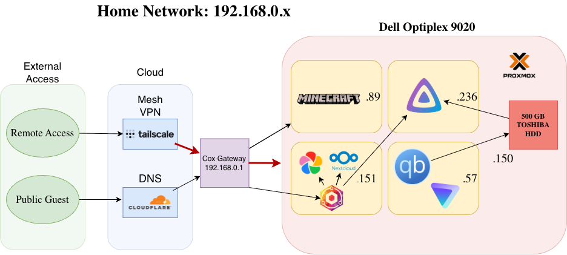

## 1. Project Overview

Hello! My name is Drew, and this repo is for my home lab. I started this lab because I wanted to get some hands on IT experience outside of my college coursework. I have had a lot of fun, and the lab is growing quickly! Alongside my documentation here - I am filming a YouTube series to show my progression as the lab continues. The name "angel server" is inspired by my favorite cat, Angel.

## 2. Infrastructure Architecture

This is a diagram I made on draw.io to give you an idea of what my home lab looks like at the moment:

## 3. Technical Stack

- **Hypervisor:** Proxmox VE 9.1 (Bare-Metal).
    
- **Guest OS:** Ubuntu Server 24.04 LTS.
    
- **Hardware:** Intel Core i5-4590, 16GB DDR3 RAM, 128GB SSD (OS), and 500GB HDD (Data).
    
- **Networking:** Static IPv4 configuration via a dedicated 100ft physical Ethernet run.

## 4. Project Roadmap & Video Series

This table shows each episode, and it's respective matching documentation links.

| **Episode** | **Phase**                    | **Primary Milestones**                                                | **Documentation**                                                                                                                        | **Video Link**                              |     |
| ----------- | ---------------------------- | --------------------------------------------------------------------- | ---------------------------------------------------------------------------------------------------------------------------------------- | ------------------------------------------- | --- |
| 01          | The Foundation               | Proxmox Installation, VM Provisioning                                 | **[SOP-01](02_SOPs/SOP-01_Proxmox_Installation.md) to [SOP-04](02_SOPs/SOP-04_Ubuntu_Server_Provisioning.md)**                           | https://www.youtube.com/watch?v=c6ZbCqxJuvM |     |
| 02          | Containerization             | Docker Engine, Portainer, Snapshots                                   | **[SOP-05](02_SOPs/SOP-05_Guest_Services_&_Data_Integrity.md)** to **[SOP-07](02_SOPs/SOP-07_Containerization_(Docker_&_Portainer).md)** | https://www.youtube.com/watch?v=fCr6QeNjRn0 |     |
| 03          | Edge Networking and Services | Nginx Proxy Manager, Cloudflare DNS, Minecraft Bedrock, Tailscale VPN | **[SOP-08](02_SOPs/SOP-08_Reverse_Proxy_Deployment_(Nginx_Proxy_Manager).md)** to **[SOP-11](02_SOPs/SOP-11_Secure_Remote_Access.md)**   | https://www.youtube.com/watch?v=fT8O6tvYz6E |     |
| 04          | System Hardening             | SSH Keys, Password Disable, Git                                       | **[SOP-12](02_SOPs/SOP-12_SSH_Key-Based_Authentication.md)**                                                                             | https://www.youtube.com/watch?v=_-WZi9831JQ |     |
| 05          | Personal Cloud               | Storage Expansion, Immich, 3-2-1 Backup                               | **[SOP-13](02_SOPs/SOP-13_Physical_Storage_Expansion.md)** to **[SOP-16](SOP-16_Automated_OS_&_Configuration_Redundancy)**               | https://www.youtube.com/watch?v=7B8NNgx1eI4 |     |
| 06          | LXC's and Media Server       |                                                                       | **[SOP-17](02_SOPs/SOP-17_Dedicated_Minecraft_LXC_&_Traffic_Redirection.md)** to **[SOP-19](02_SOPs/SOP-19_VPN_Protected_Ingest_VM.md)** | Coming Soon!                                |     |

## Repository Structure

- **[01_Knowledge_Base:](01_Knowledge_Base/Angel_Server_Breakage_Log.md)** Technical SOPs, Physical Topology Logs, and the Service Port Map.
    
- **[Angel Server MOC:](./Angel_Server_MOC.md)** The Map of Content for quick navigation across the entire project.