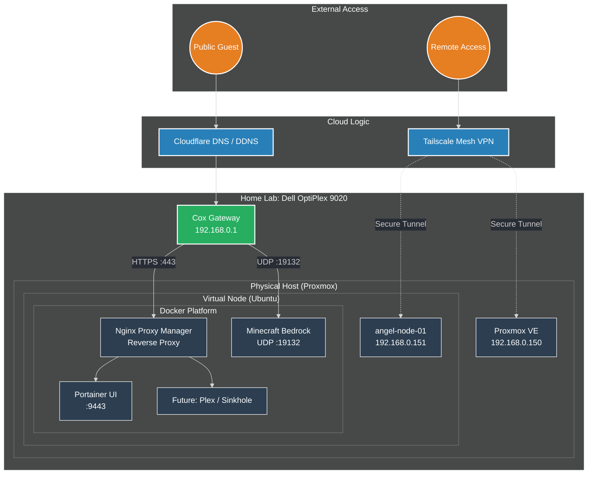

## 1. Project Overview

This is a documentation-first home lab project centered around a Dell OptiPlex 9020 SFF. This repository tracks the transition from classroom theory at Virginia Western Community College (VWCC) to hands-on Linux Administration and Enterprise Networking experience.

## 2. Infrastructure Architecture

The following diagram represents the planned architecture of the Angel Server lab as the project progresses through the YouTube series.

## 3. Technical Stack

- **Hypervisor:** Proxmox VE 9.1 (Bare-Metal).
    
- **Guest OS:** Ubuntu Server 24.04 LTS.
    
- **Hardware:** Intel Core i5-4590, 16GB DDR3 RAM, 128GB SSD (OS), and 500GB HDD (Data).
    
- **Networking:** Static IPv4 configuration via a dedicated 100ft physical Ethernet run.

## 4. Current Project Standing

The lab has completed its core infrastructure and containerization phases. The next stage of the project focuses on edge networking, external access, and service exposure using a reverse proxy and dynamic DNS.

### Completed (Episode 01: The Foundation)

- **[SOP-01](02_SOPs/SOP-01_Proxmox_Installation.md) to [SOP-04](02_SOPs/SOP-04_Ubuntu_Server_Provisioning.md)**: Successful bare-metal installation and provisioning of a hardened, headless Ubuntu VM.
    
-  **[Breakage Log](01_Knowledge_Base/Angel_Server_Breakage_Log.md)**: Resolved the ISO Lock boot error encountered during initial provisioning.

### Completed (Episode 02: The Container Engine)

- **[SOP-05:](02_SOPs/SOP-05_Guest_Services_&_Data_Integrity.md)**  Guest Agent integration and Proxmox snapshot baseline established.
    
- **[SOP-06:](02_SOPs/SOP-06_System_Hardening_&_Directory_Structure.md)** Standardized directory structure at /opt/docker and UFW hardening.
    
- **[SOP-07:](02_SOPs/SOP-07_Containerization_(Docker_&_Portainer).md)**  Deployment of the Docker Engine and Portainer management interface.

### Completed (Episode 03: Opening the Gates)

- **[SOP-08:](02_SOPs/SOP-08_Reverse_Proxy_Deployment_(Nginx_Proxy_Manager).md)** and **[SOP-09:](02_SOPs/SOP-09_Dynamic_DNS_(DDNS)_Configuration.md)** Implementation of Nginx Proxy Manager and Dynamic DNS for secure remote access.
    
- **[SOP-10:](02_SOPs/SOP-10_Minecraft_Bedrock_Edition_Deployment.md)** Deployment of a persistent Minecraft Bedrock Edition server.
	
- **[SOP-11:](02_SOPs/SOP-11_Secure_Remote_Access.md)** Implementation of a Tailscale Mesh VPN to bypass ISP port filtering and enable full remote management of the Proxmox host and Ubuntu node from external networks.

### Planned (Episode 04: The Secure Link)

- **[SOP-12:](02_SOPs/SOP-12_SSH_Key-Based_Authentication.md) Break Glass** Transitioning from password-based logins to Ed25519 public-key cryptography and disabling password authentication to harden the server against brute-force attacks.
	
- **Git Version Control**: Implementation of Git for local and remote versioning of all `/opt/docker` configurations and SOP documentation.
	
- **[SOP-12.1:](02_SOPs/SOP-12.1_Break_Glass) Key Redundancy**: Establishing "Break Glass" recovery procedures and secure key backup strategies.

### Planned (Episode 05: The Personal Cloud)

- **[SOP-13:](02_SOPs/SOP-13_Physical_Storage_Expansion.md) Physical Storage Expansion**: Mounting the internal 500GB HDD to `/mnt/data` within the Ubuntu VM to separate OS and user data.
	
- **[SOP-14:](02_SOPs/SOP-14_Immich_Photo_Engine_Deployment.md) Immich Photo Engine**: Deployment of a self-hosted, high-performance photo and video management stack as a hybrid alternative to iCloud.
	
- **[SOP-15:](02_SOPs/SOP-15_Automated_Offsite_Data_Redundancy.md) 3-2-1 Data Integrity**: Implementing automated, encrypted offsite backups for critical local storage.

## Repository Structure

- **[01_Knowledge_Base:](01_Knowledge_Base/Angel_Server_Breakage_Log.md)** Technical SOPs, Physical Topology Logs, and the Service Port Map.
    
- **[Angel Server MOC:](./Angel_Server_MOC.md)** The Map of Content for quick navigation across the entire project.