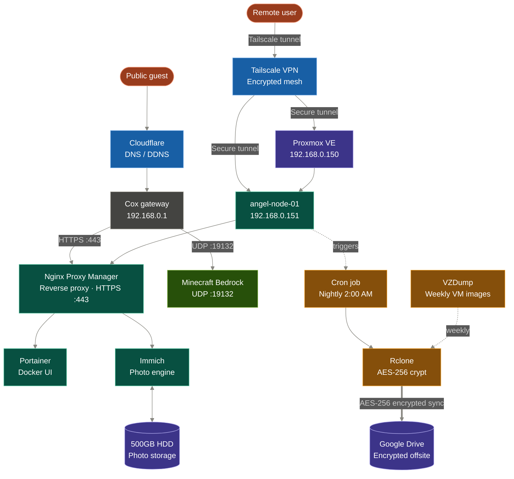

## 1. Project Overview

This is a documentation-first home lab project centered around a Dell OptiPlex 9020 SFF. This repository tracks the transition from classroom theory at Virginia Western Community College (VWCC) to hands-on Linux Administration and Enterprise Networking experience.

## 2. Infrastructure Architecture

The following diagram represents the planned architecture of the Angel Server lab as the project progresses through the YouTube series.

## 3. Technical Stack

- **Hypervisor:** Proxmox VE 9.1 (Bare-Metal).
    
- **Guest OS:** Ubuntu Server 24.04 LTS.
    
- **Hardware:** Intel Core i5-4590, 16GB DDR3 RAM, 128GB SSD (OS), and 500GB HDD (Data).
    
- **Networking:** Static IPv4 configuration via a dedicated 100ft physical Ethernet run.

## 4. Project Roadmap & Video Series

The following table tracks the transition from foundational infrastructure to high-level service deployment. Each milestone corresponds to a technical phase and its associated documentation.

| **Episode** | **Phase**                    | **Primary Milestones**                                                | **Documentation**                                                                                                                         | **Video Link**                              |     |
| ----------- | ---------------------------- | --------------------------------------------------------------------- | ----------------------------------------------------------------------------------------------------------------------------------------- | ------------------------------------------- | --- |
| 01          | The Foundation               | Proxmox Installation, VM Provisioning                                 | **[SOP-01](02_SOPs/SOP-01_Proxmox_Installation.md) to [SOP-04](02_SOPs/SOP-04_Ubuntu_Server_Provisioning.md)**                            | https://www.youtube.com/watch?v=c6ZbCqxJuvM |     |
| 02          | Containerization             | Docker Engine, Portainer, Snapshots                                   | **[SOP-05](02_SOPs/SOP-05_Guest_Services_&_Data_Integrity.md)** to **[SOP-07:](02_SOPs/SOP-07_Containerization_(Docker_&_Portainer).md)** | https://www.youtube.com/watch?v=fCr6QeNjRn0 |     |
| 03          | Edge Networking and Services | Nginx Proxy Manager, Cloudflare DNS, Minecraft Bedrock, Tailscale VPN | **[SOP-08](02_SOPs/SOP-08_Reverse_Proxy_Deployment_(Nginx_Proxy_Manager).md)** to **[SOP-11](02_SOPs/SOP-11_Secure_Remote_Access.md)**    | https://www.youtube.com/watch?v=fT8O6tvYz6E |     |
| 04          | System Hardening             | SSH Keys, Password Disable, Git                                       | **[SOP-12](02_SOPs/SOP-12_SSH_Key-Based_Authentication.md)**                                                                              | https://www.youtube.com/watch?v=_-WZi9831JQ |     |
| 05          | Personal Cloud               | Storage Expansion, Immich, 3-2-1 Backup                               | **[SOP-13](02_SOPs/SOP-13_Physical_Storage_Expansion.md)** to **[SOP-16](SOP-16_Automated_OS_&_Configuration_Redundancy.md)**             | Pending                                     |     |
|             |                              |                                                                       |                                                                                                                                           |                                             |     |
|             |                              |                                                                       |                                                                                                                                           |                                             |     |

## Repository Structure

- **[01_Knowledge_Base:](01_Knowledge_Base/Angel_Server_Breakage_Log.md)** Technical SOPs, Physical Topology Logs, and the Service Port Map.
    
- **[Angel Server MOC:](./Angel_Server_MOC.md)** The Map of Content for quick navigation across the entire project.